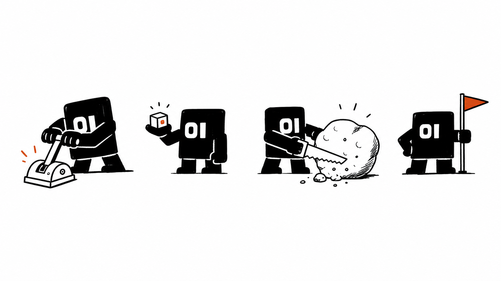

# mj-01mvp-art

Generate 01MVP-style black-and-white article illustrations: chunky `01` operator, thick marker lines, one red-orange accent, direct metaphors, and compressed social/web-ready output.

## Installation

```bash
npx skills add makerjackie/skills --skill mj-01mvp-art
```

## Usage

```text
Use $mj-01mvp-art to generate 3 compressed article illustrations for this 01MVP guide.
```

## Style Anchor



Use this as calibration, not as a fixed template.

## Notes

This skill is adapted from Ian's MIT-licensed `helloianneo/ian-xiaohei-illustrations`, but it does not reuse Xiaohei IP. It keeps the useful method: capture one cognitive anchor and turn it into a low-tech physical metaphor.

By default, final images should be compressed to `1600x900` WebP for web/docs or JPG when a social platform needs broader compatibility. Raw imagegen PNGs are working files, not final article assets.

Approved/reusable images should be uploaded to `assets.01mvp.com` through remote `wrangler` R2 by default:

```bash
skills/mj-01mvp-art/scripts/upload-r2-asset.sh images/docs/01mvp-art/example.webp /tmp/example.webp
```

The default bucket is `01mvp-public-assets`, and the upload helper uses `--remote`. Environment variables may override bucket/public URL, but the skill must never print or store API keys.
